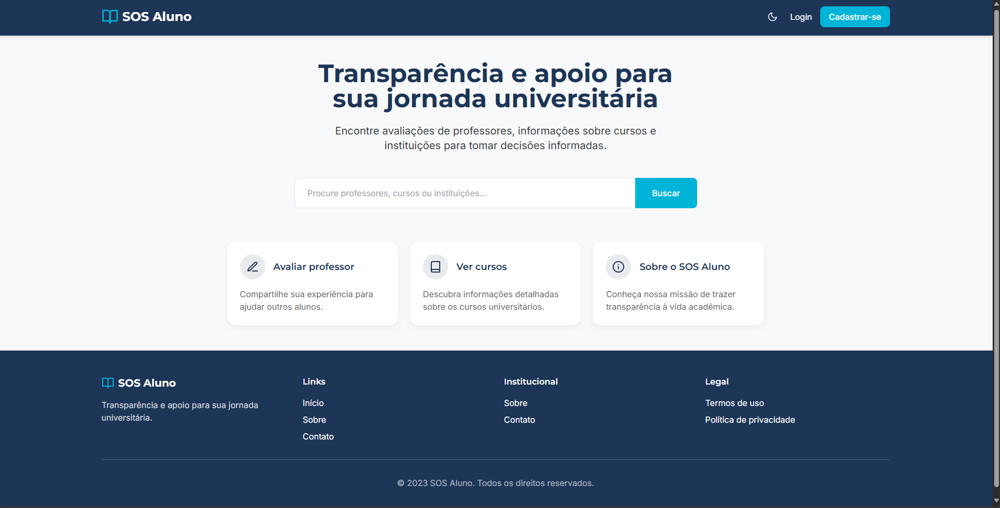
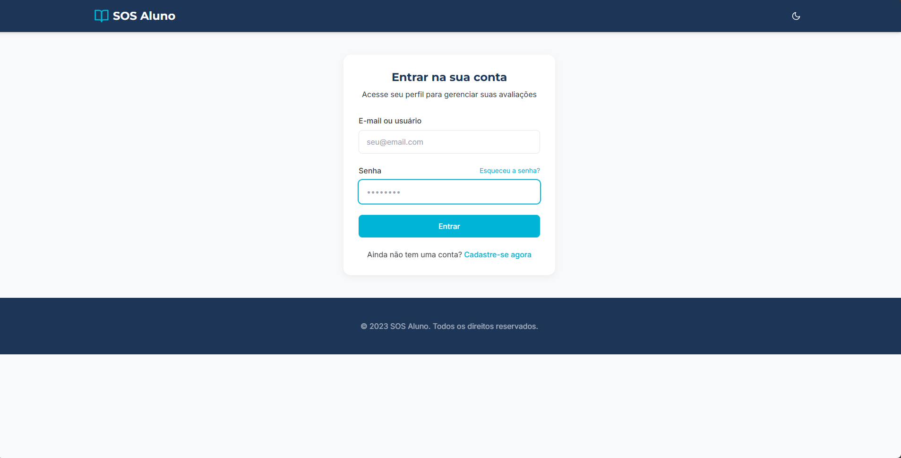
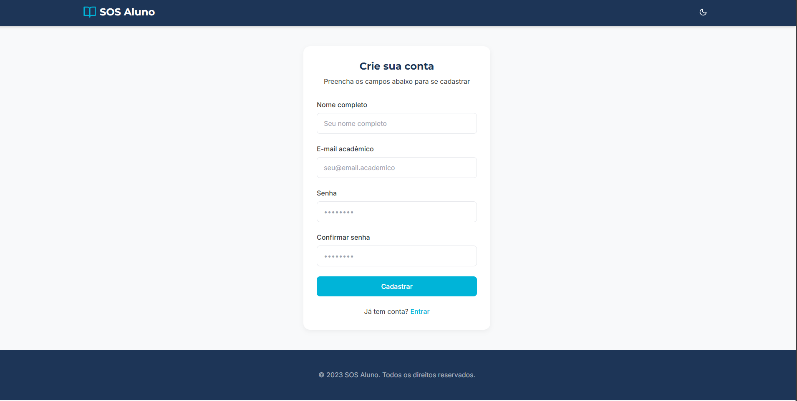

# SOS Aluno — Projeto Web

## Sumário
- [Componentes do Grupo](#componentes-do-grupo)
- [Descrição do Tema](#descrição-do-tema)
- [Como Usar o Site](#como-usar-o-site)
  - [Acesso](#acesso)
  - [Página Inicial](#página-inicial)
  - [Página de Login](#página-de-login)
  - [Página de Cadastro](#página-de-cadastro)
  - [Avaliar um Professor](#avaliar-um-professor)
  - [Consultar Avaliações](#consultar-avaliações)

## Componentes do Grupo

| Nome | Matrícula |
|------|------------|
| Marco Buffara | 2111337 |
| xxxxxxx | 22222222 |
| xxxxxxx | 2222222 |
| xxxxxxx | 2222222 |

---

## Descrição do Tema

O site **SOS Aluno** tem como objetivo criar uma plataforma colaborativa onde alunos podem avaliar o desempenho de seus professores de forma **anônima**, **transparente** e **construtiva**.

A aplicação permite que os estudantes:
- Atribuam notas e comentários aos professores;
- Consultem o perfil e a média de avaliação de cada docente;
- Filtram avaliações por curso, disciplina, universidade ou período;
- Contribuam para melhorar a qualidade do ensino por meio de feedbacks responsáveis.

**Tecnologias utilizadas:**
- Front-end: HTML, CSS
- Back-end: Django
- Banco de Dados: MySQL 
- Hospedagem: GitHub  

---

## Como Usar o Site

### Acesso
Abra o site no navegador pelo link:  
 -> [xxxxxxxxxxx](xxxxxxxxxxx)

---

### Página Inicial
A página inicial exibe uma barra para pesquisa de professores, curso ou faculdades no centro da página. No canto superior direito, tem dois butões para a página de Login e Cadastro. No rodapé da página, temos links para diferentes páginas do nosso site: **Início**, **Sobre**, **Contato**. Outrou links no rodapé são: **Termos de uso** e **Política de privacidade**

*Exemplo:*  

---

### Página de Login
A página de Login é bem simples com um campo para e-mail e senha serem preenchidos. O campo de senha tem a opção de mostrar ou não a senha que está sendo digitada. Também foram incluídos butões para levar para a página de cadastro e outro para caso o usuário tenha esquecido a senha. O nosso logo no canto superior esquerdo é a forma para voltar a página inicial.

 *Exemplo:*  

---

### Página de Cadastro
#### Esta página tem o propósito de permitir que um novo usuário se registre no sistema SOS Aluno.

- Título Principal: "Crie sua conta" – Indica o objetivo central da página.
- Instrução: "Preencha os campos abaixo para se cadastrar" – Orienta o usuário sobre o que fazer.

#### O usuário deve fornecer as seguintes informações para criar a conta:

1. Nome completo: Para identificação pessoal.
2. E-mail acadêmico: Um endereço de e-mail específico (provavelmente institucional, como indicado pelo placeholder seu@email.academico) que será usado como login.
3. Senha: A senha que o usuário usará para acessar a conta.
4. Confirmar senha: O usuário deve digitar a senha novamente para garantir que não houve erros de digitação.

 *Exemplo:*  

---

### Avaliar um Professor
Clique no botão **“Avaliar”** ao lado do nome do professor.  
Preencha o formulário com:
- Nota (de 1 a 5 estrelas ⭐)
- Comentário (opcional)
- Disciplina (opcional)

**Ainda não temos esta página feita.**

 *Exemplo:*  

---

### Consultar Avaliações
Acesse o perfil do professor para ver todas as avaliações e estatísticas.

**Ainda não temos esta página feita.**

*Exemplo:*  

---